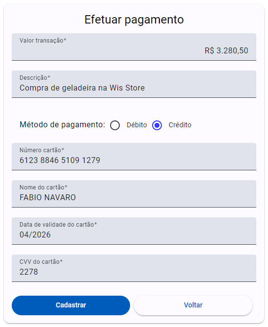
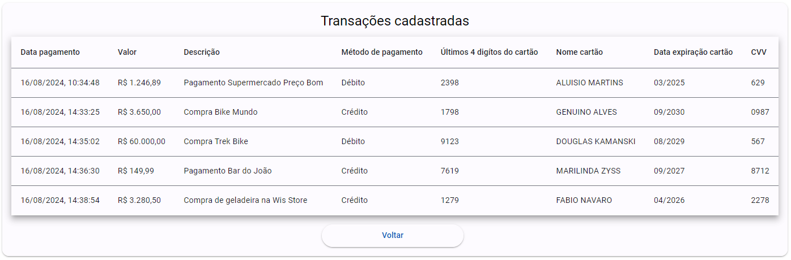
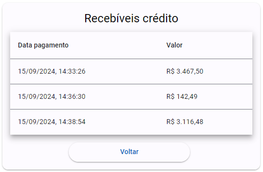
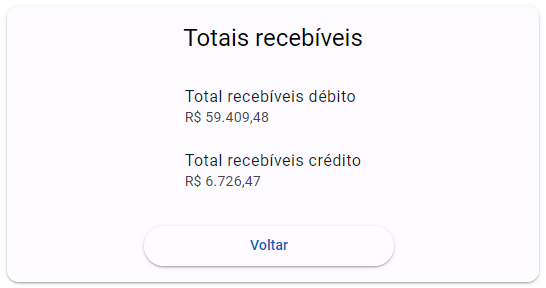

### Objetivos <h3>
Esse projeto tem o objetivo principal de servir como portfólio para demonstrar o uso do framework Angular 18, seus pacotes e linguagens.

Também tem o intuito de estudo, desenvolvimento profissional e registro de minha evolução utilizando essas tecnologias. 

### Descrição do projeto <h3>
Esse é o front-end do desafio da Pagar.me, que tem o propósito de ser um serviço de pagamento (Payment Service Provider). A descrição na íntegra pode ser encontrada <a href="https://github.com/pagarme/vagas/blob/master/desafios/software-engineer-backend/README.md">aqui</a>. 

O back-end da aplicação foi desenvolvido em C# ASP.NET Core por mim e pode ser encontrado <a href="https://github.com/douglaskamanski/payment-service-provider">aqui</a>.
 
A aplicação possuí as seguintes funções: 

* Efetuar pagamento;
* Exibir transações cadastradas;
* Exibir recebíveis débito;
* Exibir recebíveis crédito;
* Exibir totais recebíveis.

### Tecnologias utilizadas <h3>
* Angular 18;
* TypeScript;
* HTML;
* CSS.

### Ferramentas para desenvolvimento <h3>
* Visual Studio Code;
* Node.js;
* Mozilla Firefox.

### Como executar o projeto no Visual Studio Code <h3>
* Baixar o projeto no seu computador e abri-lo no VS Code;
* Rodar o projeto com o comando no terminal `ng serve` e abrir a página http://localhost:4200/;
* Certificar-se que o back-end esteja em execução. Mais informações <a href="https://github.com/douglaskamanski/payment-service-provider">aqui</a>.
 
<h1 align="center">
  
   
  
   
  
   
  
</h1>
